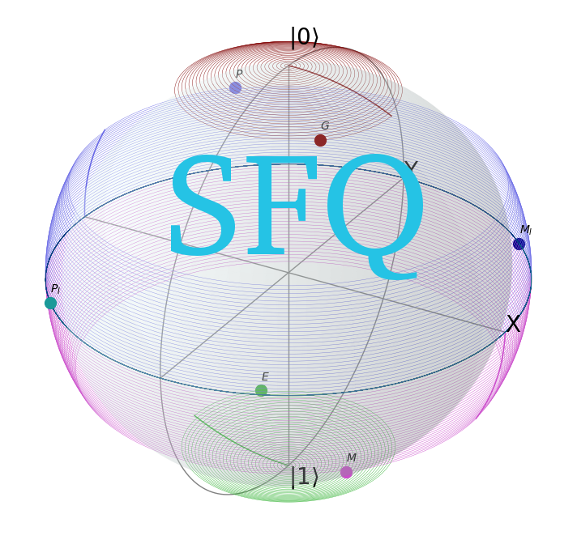

Get Started
===========

============
Installation
============

sfqlib is developed in *python2*. Although the code may run with *python3* as
well, it has not been tested on *python3*.

To install with pip.

.. code-block:: bash

   pip install sfqlib

For the latest release, use the wheel on
`Github <https://github.com/hannoeichel/sfqlib/tree/master/dist>`_ instead.

========
Overview
========

For a background of the project, please refer to this white
`paper <https://github.com/hannoeichel/sfqlib/blob/master/theory/theory.pdf>`_.

The sfqlib currently offers three features.

#. Construction and application of Time evolution operator.
#. Euler angle decomposition for spine-:math:`\frac{1}{2}` rotation.
#. Visualization of the qubit.

The qubit classes are ordered as the following.

.. inheritance-diagram:: sfqlib.sfqQubit
   :top-classes: sfqlib.sfqQubit.SfqQubit

